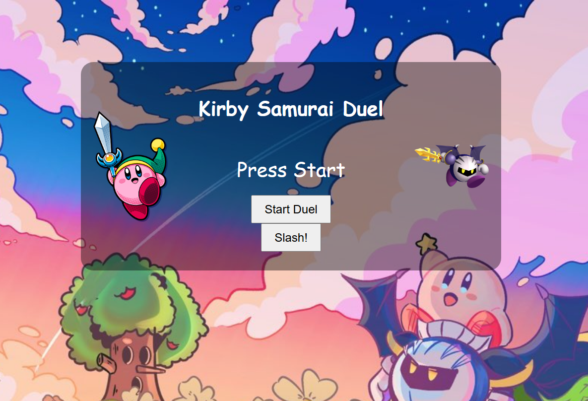

# Kirby Samurai Duel

A fast-paced reaction game where you play as Kirby in a samurai showdown! :3
Test your reflexes against increasingly faster bosses and slash before they do — but don't move too soon!!~

 

## 🕹️ How to Play

- Click **Start Duel** to face the next boss.
- Wait for the signal: **DRAW!**
- Then press `Space` **or** tap the **Slash** button as fast as you can.
- If you slash **too early**, you lose.
- If you slash **too slow**, the boss wins.
- Win to face the next, faster boss!

## 📁 Folder Structure

```

KirbySamuraiDuel/
│
├── assets/
│   ├── kirby.png
│   ├── boss.png
│   ├── kirbybg.jpg
│   ├── kirbywin.gif
│   └── kirbylose.gif
│
├── index.html
├── style.css
└── script.js

```

## ✅ Features

- Reaction-based timing mechanic!!!
- 6 bosses with increasing difficulty~
- Fun victory and loss GIFs :3
- Mobile support (touch/tap friendly Slash button)

## 🚀 Try it out!!

> https://CosMoxTheLegend.github.io/KirbySamuraiDuel

## 🛠️ Built With

- HTML5
- CSS3
- JavaScript (Vanilla)

## 📸 Credits

- Kirby & Boss sprites and background belong to their respective rights holders.
- background from @NekoLilyOFC (twitter)
  
---

I randomly got the idea for this project because my friends and I used to have a lot of fun playing *Kirby: Nightmare in Dream Land*—especially the samurai duel minigame. We absolutely loved it. So I thought it would be fun to create something similar. I was still learning how to code at the time, and this felt like a perfect little project to work on!


Enjoy the duel, and may your reflexes be swift ⚔️


